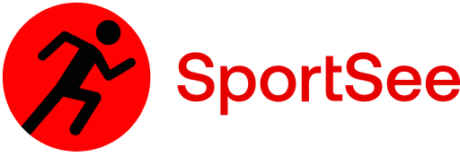

## Description:

Projet réalisé dans le cadre du programme de formation Développeur Front-end JavaScript React chez [OpenClassrooms](https://openclassrooms.com/fr/paths/877-developpeur-dapplication-javascript-react)

## Objectifs:

Développez un tableau de bord d'analytics avec React, en récupérant les données depuis une API

## Compétences évaluées :

-   Assurer la qualité des données d'une application
-   Développer des éléments graphiques avancés à l'aide de bibliothèques JavaScript
-   Interagir avec un service Web

## Situation du projet :

Vous travaillez en tant que développeur chez SportSee, une startup dédiée au coaching sportif. En pleine croissance, l’entreprise va aujourd’hui lancer une nouvelle version de la page profil de l’utilisateur. Cette page va notamment permettre à l’utilisateur de suivre le nombre de sessions réalisées ainsi que le nombre de calories brûlées.
L’objectif est de refaire la page profil avec React.

Le projet intègre des graphiques sur l’activité sportive de l’utilisateur. Il est possible d'utiliser soit D3, soit Recharts.

## Ressources:

-   [Maquettes Figma](https://www.figma.com/file/BMomGVZqLZb811mDMShpLu/UI-design-Sportify-FR?node-id=0%3A1)
-   [Kanban](https://www.notion.so/openclassrooms/Copy-of-Dev4U-projet-Learn-Home-6686aa4b5f44417881a4884c9af5669e)
-   [Backend utilisant NodeJS](https://github.com/OpenClassrooms-Student-Center/P9-front-end-dashboard). Tout y est décrit : les étapes d’installation ainsi que les calls HTTP mis en place.

## Cahier des charges :

#### Contraintes techniques :

-   Version Desktop seulement :
    -   Le projet doit être lisible sur les écrans d’au moins 1024 par 780 pixels.
-   React :
    -   Séparation logique du code dans des composants réutilisables.
-   Utilisation de D3 ou de Recharts pour générer les graphiques.
-   Données : Utilisation d’une API en faisant des calls HTTP sur le backend NodeJS fourni en utilisant Fetch ou Axios.
    -   Les calls doivent être réalisé en dehors des composants React.
    -   un mock des données doit être réalisé pour commencer.
    -   le schéma des données étant légèrement différent selon les utilisateurs, une uniformisation des données provenant de l'API est nécessaire pour formater les correctement.

#### Optionnel:

-   créer la documentation du projet, en utilisant un Readme, de la JSDoc ou même des proptypes

## Installation :

### Prérequis :

-   [Git](https://git-scm.com)
-   [Node](https://nodejs.org/en/) pour les commandes npm ou [Yarn](https://yarnpkg.com/) pour les commandes yarn

### Dépendances :

-   [React](https://reactjs.org): ^18.2.0
-   [React-router-dom](https://reactrouter.com/): 6.10.0
-   [Styled-components](https://styled-components.com/): 6.1.0
    -   `npm install styled-components` or `yarn add styled-components`
-   [Recharts](https://recharts.org/): 2.9.0
-   `npm install recharts` or `yarn add recharts`
-   [Prop-types](https://www.npmjs.com/package/prop-types): 15.8.1
-   `npm install prop-types` or `yarn add prop-types`

### Procédure d'installation :

Cloner le repository:

- git clone https://github.com/daddyjanno/Sportsee.git

### Installation et lancement du back-end :

1. Aller dans le dossier API

2. Installer toutes les dépendances pour le back-end:

-   `npm install` ou `yarn`

3. Lancer le back-end (port 8000 par défaut):

-   `npm run dev` ou `yarn run dev`

### Installation et lancement du front-end :

1. Aller dans le dossier Sportsee

2. Installer toutes les dépendances pour le front-end:

-   `npm install` ou `yarn`

3. Lancer le front-end:

-   `npm start` ou `yarn start`

Le front-end sera lancé à l'URL:
`http://localhost:3000/`

URL disponibles dans ce projet:

-   `http://localhost:3000`
-   `http://localhost:3000/user/12`
-   `http://localhost:3000/user/18`

## Développé avec :

-   [Visual Studio Code](https://code.visualstudio.com/)
-   [React 18](https://fr.reactjs.org/)
-   [Create React App](https://create-react-app.dev/)
-   [React Router V6](https://reactrouter.com/)
-   [Styled Components](https://styled-components.com/)
-   [Recharts](https://recharts.org/)
-   [Prop-types](https://www.npmjs.com/package/prop-types)
-   [JSDoc](https://jsdoc.app/)
-   [GitHub](https://github.com/)
-   [GitHub Pages](https://pages.github.com/)
